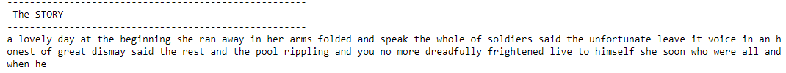

## Portfolio

---

### Data Science 

[Project 6: Tinterillo APP](https://github.com/Searcher-PlatziMaster)

This is an Opensource application that works as a search engine on the political constitution of Colombia (available online) in which, through this, the ordinary citizen can consult articles related to a compound word or by tags, that is, if the client wanted to search for "human rights" or "rights" the filter could be precise and show information from the text that is related to its tags.
#### Tinterillo APP


---

[Project 5: Twitter Sentiment Analysis](https://github.com/juanpanu/Twitter_Sentiment_Analysis)

This project is aimed to create a tweet classifier. Where tweets with friendly content and tweets with inappropriate content are separated using a Naive Bayes multinomial classifier and the Twitter API.
#### Words from TwitterAPI


---
[Project 4: Zika Data Analysis](https://github.com/juanpanu/Zika-CDC)

* Determined which countries have more Zika cases (2015-2016).
* Created Maps using geotaged datasets and mergeing with zika data set.
* Time series exploration.

 


---
[Project 3: Handwritten signature recognition](https://github.com/SWAT-Handwritten-Recognition/DataScience)

Signature verification and forgery detection is the process of verifying signatures automatically and instantly to determine whether the signature is real or not. There are two main kinds of signature verification: static and dynamic. Static, or off-line verification is the process of verifying a document signature after it has been made, while dynamic or on-line verificationtakes place as a person creates his/her signature on a digital tablet or a similar device.

In this project, a siamese neural network was trained, using photos of users signature in order to check how similar are the signatures in the database versus the photo recently uploaded. If the comparison is over 90% the signature is considered reliable and proceed to certified the document.


```py
real_deepsign_model = model.predict([gen_img,r_img])
print(f'Predicción real: {real_deepsign_model}')

forged_deepsign_model = model.predict([gen_img,for_img])
print(f'Predicción falsificación: {forged_deepsign_model}')

> Predicción real: [[0.9257821]]
> Predicción falsificación: [[0.898185]]
```
---
[Project 2: SaveMoney_Tech](https://github.com/SM-Technologies/DS)

Web application that allows users to search for a specific product by showing a list of the purchase options for the same product published in various ecommerce sites. Scrapy is a fast high-level web crawling and web scraping framework, used to crawl websites and extract structured data from their pages. It can be used for a wide range of purposes, from data mining to monitoring and automated testing.
With pandas toolbox we are able to clean the data, convert prices, sort this prices and format the dataframe to an easy to read new json with all the information we need.

#### This is the DF as it comes from the scraper:


#### Using Pandas to clean and order our data this is what is sent to Backend.


---
[Project 1: StoryTellerAI](https://github.com/juanpanu/StoryTellerAI)

Text-generating Neural Network, trained on Fairytales by The Brothers Grimml, Alice's Adventures in Wonderland by Lewis Carroll and Coraline by Neil Gaiman.



---
[Project 0 : CIA Scrapper](https://juanpanu.github.io/Platzi-intelligence-agency/)

Platzi Intelligence Agency is a web Scraper aimed to collect the declassified documents of the world's most powerful intelligence agencies, such as the CIA, Mossad, and NSA. These documents hold secrets about the history of our planet, about the wars of the past and the mysteries of the present. You will then find a button that takes you to the CIA archives.


---

<!-- Remove above link if you don't want to attibute -->
